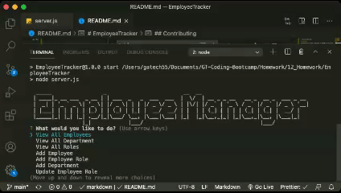

# EmployeeTracker

David K. Brown's Employee Tracker

## Table of Contents

- [Description](#description)

- [Screenshots](#screenshots)

- [Acceptance-Criteria](#Acceptance-Criteria)

- [Installation](#installation)

- [Credits](#credits)

- [Contributing](#contributing)

- [Copyright](#copyright)

## Description

The purpose of this app was to make it easy for a manager to view and edit their employees in a CMS. The app uses node, inquirer and MySQL. The database contains tables for department, role and employee. The UI for this app is found in the command0line and it allows a user to add/view/update departments, roles and employees. Future development will allow for additional views and the ability to delete.

## Screenshots



## Acceptance-Criteria

```md
## Requirements

As a business owner
I want to be able to view and manage the departments, roles, and employees in my company
So that I can organize and plan my business
```

## Installation

To access this application you will need to visit my GitHub page and the "EmployeeTracker" repository. After the repository is cloned/forked you can make edits to the application in your repository. Any questions should be directed to [David Brown](mailto:gatech55@gmail.com). The application repository can be found here: [EmployeeTracker](https://github.com/GaTech55/EmployeeTracker).

## Credits

© 2019 Trilogy Education Services, a 2U, Inc. brand. All Rights Reserved.
[GitLab-12-Homework](https://gt.bootcampcontent.com/GT-Coding-Boot-Camp/gt-inc-fsf-pt-08-2020-u-c/tree/master/12-MySQL/02-Homework)

## Contributing

| **Commits** | **Contributor** |

| 19| [GaTech55](https://github.com/GaTech55)|

## Copyright

Copyright (c) 2021 David Brown.
